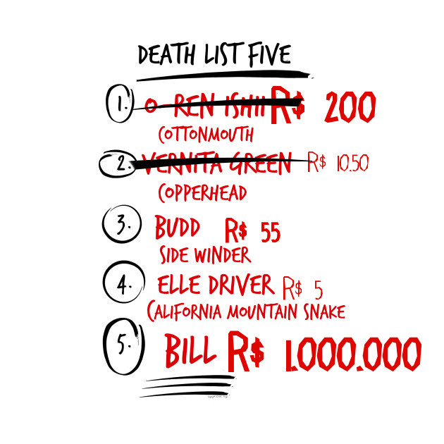

# Quill Bill

# Fatie suas contas!
Quill Bill é uma aplicação de divisão de despesas. A melhor forma de listar quem te deve!

# Funcionamento
A plataforma funciona em duas aplicações, um servidor RESTful java e um app cliente para Android. Eles se comunicam com HTTP.
O servidor utiliza um banco de dados em [PostgreSQL](https://www.postgresql.org/) e framework de HTTP [Spark Java](http://sparkjava.com/). Este é compilado e construido com [Maven](https://maven.apache.org/).

# Andamento
## Cliente
- [x] LoginActivity
 - [x] Login
 - [x] Signup
- [ ] MainActivity
 - [x] Show bills
 - [ ] Create bills
- [ ] Bill Activity
 - [ ] CRUD expenses
 - [ ] CRUD Users from bill
 - [ ] Close bill

## Servidor
- [x] Schema banco de dados
- [x] Base REST e comunicaço com o banco de dados
- [x] UsersController
- [x] AuthenticationsController
- [ ] AuthorizationsController
- [ ] BillsController
- [ ] ExpensesController

## Requisitos
 - Java >=1.8
 - Maven >=3.3.9
 - PostgreSQL >= 9.5
 - Android Studio

## Integrantes
 - Lucas Ricarte
 - Bruno Costa
 - Lucas Braida
 - Rodrigo Lemos
 - Vinay Rao

[Quill Bill](https://github.com/lucasrrt/Quill-Bill)
